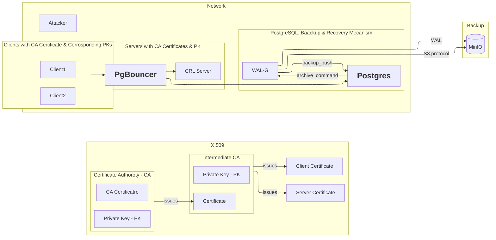

# Defense-in-Depth: System Design

```mermaid
---
config:
  layout: elk
  elk:
    nodePlacementStrategy: LINEAR_SEGMENTS
---
flowchart LR
    subgraph X [X.509]
        subgraph C [Certificate Authoroty - CA]
            CA[CA Certificatre]
            PK[Private Key - PK]
        end
        subgraph I[Intermediate CA]
            ICA[Certificate]
            IPK[Private Key - PK]
        end
        
        CC[Client Certificate]
        SC[Server Certificate]
        C --issues--> ICA
        I --issues--> CC
        I --issues--> SC
        
    end
    subgraph Network
        At[Attacker]

        subgraph Clients [Clients with CA Certificate & Corrosponding PKs]
            A[Client1]
            B[Client2]
        end
        
        subgraph Server [ Servers with CA Certificates & PK]
            Proxy[PgBouncer]:::big
            classDef big font-size:25px,font-weight:bold;
            CRL[CRL Server]
        end

        subgraph DB [PostgreSQL, Baackup & Recovery Mecanism]
            POS[Postgres]:::big
            WAL[WAL-G]
        end
        Clients --> Proxy
        Proxy --> POS
        Proxy --> CRL
        POS --archive_command--> WAL
        WAL --backup_push--> POS
    end
    subgraph DBB [Backup]
        LOG@{ shape: cyl, label: "MinIO"}
        
        WAL[WAL-G]
    end
    WAL --S3 protocol--> LOG
    WAL --WAL--> LOG  
```
