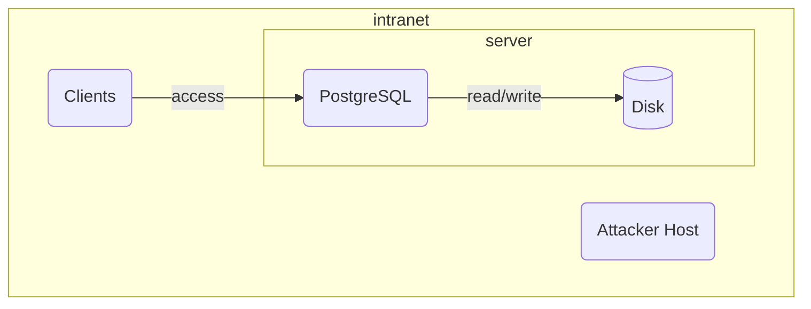
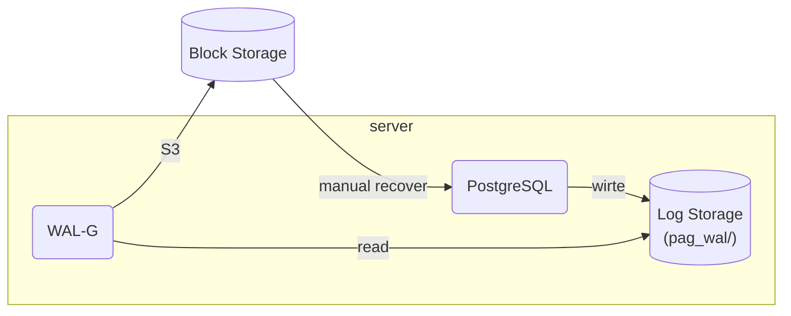

# Defense-in-Depth: A case study on hardening Database Servers

## Introduction

An attacker has gained access to the internal network (post-breach). The objective is to determine what mechanisms prevent them from accessing, reading, modifying, or exfiltrating sensitive data from a PostgreSQL database system, and what mechanisms enable recovery when prevention fails.

This document defines the threat model for Project 5, which investigates post-breach database protection using defense-in-depth approaches. The threat analysis uses the STRIDE framework applied at each trust boundary in a PostgreSQL deployment. 

Hardening controls are derived from CIS PostgreSQL 17 Benchmark v1.0.0.

## Basline system

The baseline system is a PostgreSQL server deployed on a Linux machine that provides service through default port `5432` and persists data to an un-encryped file system (such as ext4) on a local disk. An attacher has already gained access to an internal server but haven't infiltrated to the machine hosting the PostgreSQL system.

## Key assets

What we need to protect inside the PostgreSQL system are:

1. Sensitive data in tables.
2. Credentials to gain access to the PostgreSQL.
3. Network traffic goes in and out of the PostgreSQL server.

## Trust boundaries

Identify where data crosses from one trust level to another. Those boundaries are the targets of the hacker to gain further access to the assets.

| ID | Boundary                  | Crosses from               | Crosses to                  |
| -- | ------------------------- | -------------------------- | --------------------------- |
| B1 | Network              | Untrusted network (breached)          | Database listener           |
| B2 | Authentication    | Anonymous connection       | Authenticated session       |
| B3 | Authorization  | Authenticated user         | Authorized data access      |
| B4 | Storage     | Filesystem / disk access   | Raw data files              |

## Threat enumeration 

This section lists threats by applying STRIDE at each trust boundaries.

### Threats at B1 Network boundary

| ID   | STRIDE   | Threat                                                |
| ---- | -------- | ----------------------------------------------------- |
| T1.1 | Spoofing | Attacker impersonates the database server to a legitimate client (rogue server) |
| T1.2 | Spoofing | Attacker connects to the database without valid identity |
| T1.3 | Tampering | Attacker intercepts and modifies queries or results in transit (Man-in-the-Middle) |
| T1.4 | Infomation Discovery | Attacker extracts information by passively captures database network traffic and |
| T1.5 | DoS | Attacker floods the database with connection attempts, exhausting server resources |

### Authentication boundary

| ID   | STRIDE   | Threat                                                |
| ---- | -------- | ----------------------------------------------------- |
| T2.1 | Spoofing | Attacker authenticates with easy to guess credentials (dictionary attack) |
| T2.2 | Spoofing | Attacker presents a stolen but valid credentials during the authentication |
| T2.3 | Spoofing | Attacker authenticates using a weak method (e.g., password, trust) when a stronger method should be required |
| T2.4 | Repudiation | A user performs actions but the authentication method does not provide non-repudiation |
| T2.5 | Infomation Discovery | Certificate private keys are stored insecurely and extracted by the attacker |

### Authorization boundary

| ID   | STRIDE   | Threat                                                |
| ---- | -------- | ----------------------------------------------------- |
| T3.1 | Information discovery | Authenticated user reads rows or columns they should not have access to |
| T3.2 | Tampering | Authenticated user modifies or deletes rows outside their permitted scope |
| T3.3 | Elevation | Low-privilege user escalates to superuser via CREATEROLE or role inheritance |
| T3.4 | Elevation | Application role accesses system catalogs, server files, or executes OS commands |
| T3.5 | Repudiation | User accesses or modifies sensitive data but no audit trail exists to prove it |
| T3.6 | DoS | Authenticated user runs resource-exhausting queries (intentional or accidental) |

### Threats at B4 — Storage boundary

| ID   | STRIDE   | Threat                                                |
| ---- | -------- | ----------------------------------------------------- |
| T4.1 | Information discovery | Attacker obtains a disk image, snapshot, or physical drive and reads raw data files offline |
| T4.2 | Information discovery | Attacker with live shell access reads table data files directly through the mounted filesystem, bypassing all database-level controls |
| T4.3 | Information discovery | Attacker with live shell access reads pg_wal/ directory and extracts plaintext data changes from WAL segments |
| T4.4 | Information discovery | Attacker with live shell access reads pgcrypto-encrypted columns from data files, but cannot decrypt them without the application-layer key |
| T4.5 | Tampering | Attacker modifies data files on disk (corruption or targeted alteration) |
| T4.6 | Elevation | Database superuser reads arbitrary server files via built-in functions (pg_read_file, COPY) |

## Mitigation strategy

This section proposes mitigations for the threats enumerated in Section 4. Mitigations are grouped by defense layer and reference specific threat IDs. Each mitigation is assigned a priority that determines implementation depth.

**Priority definitions:**

- **Demo** — Full attack-then-harden cycle with live demonstration
- **Config** — Implemented and verified, shown in configuration walkthrough
- **Acknowledge** — Documented as known limitation or residual risk

### Network and transport layer (TLS / X.509)

| Addresses     | Mitigation                                                | Priority    |
| ------------- | --------------------------------------------------------- | ----------- |
| T1.4, T1.3    | Enforce TLS on all connections; disable non-SSL listeners | Demo        |
| T1.1, T1.2    | Require mutual TLS with client certificate verification (verify-full) | Demo |
| T2.1          | Validate client certificates against a known CA; reject untrusted signers | Demo |
| T2.2          | Implement certificate revocation checking (CRL)           | Config      |
| T2.4    | Log certificate CN with each connection event             | Config      |
| T1.5          | Configure max_connections and connection rate limiting     | Acknowledge |
| T2.5          | Restrict filesystem permissions on certificate private keys | Config    |

### Access control layer (RBAC / RLS)

| Addresses     | Mitigation                                                | Priority    |
| ------------- | --------------------------------------------------------- | ----------- |
| T3.1          | Implement row-level security policies per role            | Demo        |
| T3.1          | Restrict column access via column-level GRANT             | Demo        |
| T3.2          | Apply RLS with RESTRICTIVE option for write operations    | Demo        |
| T3.3          | Revoke CREATEROLE and SUPERUSER from all application roles | Demo       |
| T3.4          | Revoke pg_read_server_files, pg_execute_server_program    | Config      |
| T3.5          | Enable pgAudit for per-role query logging                 | Config      |
| T3.6          | Set statement_timeout per role                            | Acknowledge |

### Storage encryption layer (two-layer approach)

This layer uses two complementary encryption mechanisms. Each addresses a different attacker position; neither is sufficient alone.

**Layer A — Block-level encryption (LUKS / dm-crypt):**

Encrypts the entire PostgreSQL data directory at the filesystem level, including table files, pg_wal/, indexes, and configuration. Protects against offline access (stolen disk, cloud snapshot, decommissioned drive). Transparent to any process on the running host — does not protect against live shell access.

| Addresses     | Mitigation                                                | Priority    |
| ------------- | --------------------------------------------------------- | ----------- |
| T4.1          | Encrypt PG data directory with LUKS on a dedicated volume | Demo        |
| T4.3 (partial)| WAL files encrypted at rest on local disk via LUKS       | Demo        |
| T4.5          | Enable data checksums (initdb --data-checksums) to detect offline tampering | Config |

**Layer B — Column-level encryption (pgcrypto):**

Encrypts specific high-value columns within the database. Data remains encrypted in table files, in WAL segments, and in pg_dump output. Decryption requires the application-layer key, which is not stored in the database. Protects against live-shell attackers who can read files through the mounted filesystem, and against database users who bypass RBAC but lack the application key.

| Addresses     | Mitigation                                                | Priority    |
| ------------- | --------------------------------------------------------- | ----------- |
| T4.2          | Encrypt sensitive columns (SSN, credit card, etc.) with pgcrypto | Demo  |
| T4.4          | pgcrypto values remain encrypted even when read via pg_read_file or strings on data files | Demo |
| T4.6          | Revoke pg_read_server_files, pg_execute_server_program from application roles | Config |

**Planned escalation demo for storage encryption:**

The demonstration will show three attacker positions against the same data:

1. Offline attacker reads raw disk image → LUKS blocks all access
2. Live-shell attacker reads data files on mounted filesystem → non-pgcrypto columns are readable in plaintext; pgcrypto columns appear as binary noise
3. Authenticated attacker queries the database → RBAC/RLS controls access; pgcrypto columns return encrypted bytea without the application key

This three-step escalation demonstrates why both layers are necessary and why neither replaces the other.

### Backup and recovery 

Default PostgreSQL ships with archive_mode = off and no archive_command. WAL segments are recycled once no longer needed for crash recovery. This means a destructive event, such as ransomware, malicious DROP TABLE, or total host loss, is irrecoverable beyond the most recent pg_dump, if one exists. Enabling continuous WAL archiving with periodic base backups is itself a security mitigation: it provides point-in-time recovery to the moment before an incident.

However, enabling archiving introduces new attack surface: WAL archives contain a full record of all data changes and must be protected in transit and at rest. The mitigations below address both the recovery gap and the security of the archiving pipeline.

## Known gaps and residual risks

### Key protection for runtime secrets

The fundamental challenge of any encryption-based defense is that the decryption key must be accessible to the process that uses it. Two keys in this project face this problem:

**Client certificate private keys (T2.5).** 
The client's private key must be readable by the psql or application process at connection time. If stored as a file on disk, any attacker who compromises the client host can copy the key and impersonate the user from any location. Available mitigations form a spectrum of increasing strength:

| Approach                     | Protects against                       | Does not protect against              |
| ---------------------------- | -------------------------------------- | ------------------------------------- |
| File permissions (chmod 600) | Other non-root users on same host      | Root compromise, postgres user compromise |
| Passphrase-protected key     | File copy (attacker needs passphrase)  | Live shell with keylogger or memory access |
| Hardware token (PKCS#11)     | Key extraction (key never leaves device) | Session hijacking while token is plugged in |
| Short-lived certs (Vault PKI, SPIFFE) | Long-term key theft (cert expires in minutes/hours) | Compromise during the cert's short lifetime |

## Scope definition

### In scope

- X.509 mutual TLS authentication for PostgreSQL
- Role-based access control with row-level security
- Two-layer encryption at rest: LUKS (block-level) + pgcrypto (column-level)
- WAL archiving with WAL-G and libsodium encryption to MinIO
- Point-in-time recovery demonstration
- Three-position attacker escalation demo for storage encryption
- Baseline (misconfigured) vs. hardened configuration comparison
- STRIDE-based threat analysis and CIS Benchmark alignment

### Out of scope

- Network perimeter security (firewalls, IDS/IPS)
- Application-layer SQL injection prevention
- Multi-node clustering and high availability
- Production KMS integration (AWS KMS, Vault)
- PostgreSQL TDE (not available in upstream PG 17)
- Hardware encryption (TPM/T2/SED) — discussed as production equivalent to LUKS
- Operating system hardening beyond filesystem permissions
- Performance benchmarking of security controls
