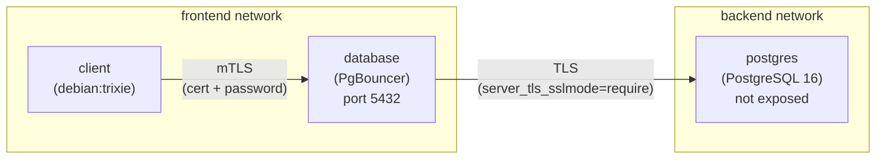
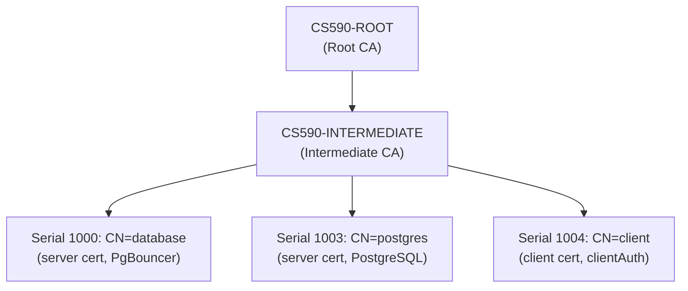

# Database Hardening Report

## 1. Program Description

This project demonstrates database security hardening techniques applied to a PostgreSQL 16 deployment running in Docker Compose. The objective is to transform an insecure baseline system into a defense-in-depth architecture using a connection proxy, transport encryption, mutual authentication, and least-privilege access control.

### Baseline System

The baseline system (`../baseline/docker-compose.yaml`) consists of two containers:

- **database** (postgres:16) -- PostgreSQL with port 5432 exposed directly to the host, using a superuser account (`postgres`) with a plaintext password.
- **client** (debian:trixie) -- A general-purpose client container.

The database stores sensitive data including employee names, credit card numbers, and salary information (`../baseline/init.sql`).

### Threat Model

The baseline system is vulnerable to the following threats:

| Threat | Description |
|--------|-------------|
| Eavesdropping | All traffic between client and database is unencrypted. An attacker on the network can capture credentials and query results in plaintext. |
| Unauthorized access | Any network host can connect directly to PostgreSQL on port 5432 with only a password. |
| Privilege escalation | The only available account is the `postgres` superuser, which has unrestricted access to all data and database configuration. |
| No client identity verification | The database has no way to verify the identity of connecting clients beyond a shared password. |

## 2. Solution Architecture

The hardened system (`docker-compose.yaml`) introduces four independent security layers.

### Architecture Diagram



- The **client** container exists only on the `frontend` network.
- The **database** service (PgBouncer) bridges both `frontend` and `backend` networks.
- The **postgres** service exists only on the `backend` network and exposes no ports to the host.

### Layer 1 -- Network Isolation

Two Docker networks (`backend` and `frontend`) segment the infrastructure. The client container can only resolve and reach the `database` service (PgBouncer). The `postgres` service is invisible to the client -- DNS resolution fails and TCP connections are impossible.

### Layer 2 -- TLS Everywhere

All database traffic is encrypted in transit:

- **Client to PgBouncer** (frontend TLS): PgBouncer presents a server certificate (CN=`database`) and requires TLS from all connecting clients. Plaintext connections are rejected with `FATAL: SSL required`.
- **PgBouncer to PostgreSQL** (backend TLS): PgBouncer connects to PostgreSQL over TLS (`server_tls_sslmode=require`) and verifies the server's certificate against the CA chain.
- **PostgreSQL server TLS**: PostgreSQL is configured with `ssl=on` and presents a server certificate (CN=`postgres`) signed by the intermediate CA.

### Layer 3 -- Mutual TLS (mTLS)

PgBouncer is configured with `client_tls_sslmode=verify-ca`, which requires clients to present a valid certificate signed by the trusted CA chain. This adds a non-forgeable authentication factor: even if an attacker obtains a password, they cannot establish a TLS connection without a valid private key.

### Layer 4 -- Authentication and Authorization

Authentication and authorization are separated:

- **Authentication** uses two independent factors:
  1. A client certificate verified by PgBouncer against the CA chain (mTLS).
  2. A password verified via SCRAM-SHA-256 (a salted challenge-response protocol that never sends the password in cleartext).
- **Authorization** is enforced by PostgreSQL roles. The `finance` role (`init.sql`) can only execute SELECT queries on the `secret_data` table. INSERT, UPDATE, and DELETE operations are denied by the database.

### PKI Structure

The certificate infrastructure uses a two-tier hierarchy:



All certificates are signed by the intermediate CA and verified against the full chain (`certs/ca-chain.cert.pem`). The CA and intermediate CA directories are maintained in `../keywork/root_ca/` and `../keywork/intermediate_ca/` respectively.

### Key Files

| File | Purpose |
|------|---------|
| `certs/ca-chain.cert.pem` | CA trust chain (intermediate + root), used by all services for certificate verification |
| `certs/server.crt` / `server.key` | PostgreSQL server certificate and private key (CN=postgres) |
| `certs/pgbouncer.crt` / `pgbouncer.key` | PgBouncer server certificate and private key (CN=database) |
| `certs/client.crt` / `client.key` | Client certificate and private key (CN=client, extendedKeyUsage=clientAuth) |

### Connecting to the Database

From within the client container, connect to the database through PgBouncer as the `finance` user:

```bash
psql "host=database port=5432 dbname=mydb user=finance password=finance_pass \
  sslmode=require sslcert=/certs/client.crt sslkey=/certs/client.key sslrootcert=/certs/ca.crt"
```

## 3. Audit Results

The following tests were executed against the running `with_proxy` stack to verify each security layer.

| # | Test | Result | Evidence |
|---|------|--------|----------|
| 1 | PostgreSQL port not exposed to host | **PASS** | `docker compose port postgres 5432` returns `:0` (no binding); PgBouncer returns `0.0.0.0:5432` |
| 2 | SSL enabled on PostgreSQL | **PASS** | `SHOW ssl` returns `on` |
| 3 | Client with cert + password connects | **PASS** | `psql` with `sslmode=require sslcert=/certs/client.crt sslkey=/certs/client.key` as `finance` successfully returns all rows from `secret_data` |
| 4 | Client without cert is rejected | **PASS** | `psql` without cert files: `SSL error: tlsv13 alert certificate required` |
| 5 | Client with cert but wrong password is rejected | **PASS** | `psql` with cert but `password=wrong`: `FATAL: SASL authentication failed` |
| 6 | Finance user cannot INSERT | **PASS** | `INSERT INTO secret_data VALUES (...)`: `ERROR: permission denied for table secret_data` |
| 7 | PgBouncer-to-PostgreSQL backend uses SSL | **PASS** | `pg_stat_ssl JOIN pg_stat_activity` shows `ssl = t` for PgBouncer's connection from `192.168.156.3` |
| 8 | Client cannot reach PostgreSQL directly | **PASS** | `echo > /dev/tcp/postgres/5432` from client: `postgres: Name or service not known` |

### Audit Interpretation

- **Tests 1 and 8** confirm **network isolation**: PostgreSQL is unreachable from both the host and the client container.
- **Test 2 and 7** confirm **TLS everywhere**: PostgreSQL has SSL enabled, and the backend connection from PgBouncer uses it.
- **Tests 3 and 4** confirm **mTLS**: a valid client certificate is required to establish a connection.
- **Test 5** confirms **password authentication**: the certificate alone is insufficient; the correct password is also required.
- **Test 6** confirms **least-privilege authorization**: the `finance` role can read data but cannot modify it.

## 4. Baseline vs. Hardened Comparison

| Aspect | Baseline | Hardened |
|--------|----------|---------|
| Database exposure | Port 5432 exposed to host | Not exposed; only reachable via PgBouncer on the backend network |
| Connection proxy | None | PgBouncer acts as a transparent proxy (service name `database`) |
| Encryption | None | TLS on all connections (client-to-proxy and proxy-to-database) |
| Client identity | None | mTLS -- clients must present a CA-signed certificate |
| Authentication | Superuser password only | Two-factor: client certificate + SCRAM-SHA-256 password |
| Authorization | Superuser (`postgres`) with full access | Least-privilege role (`finance`) with SELECT-only grant |
| Network segmentation | Single default network | Separate `frontend` and `backend` networks |
